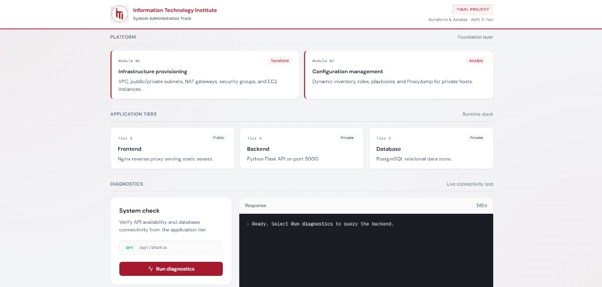
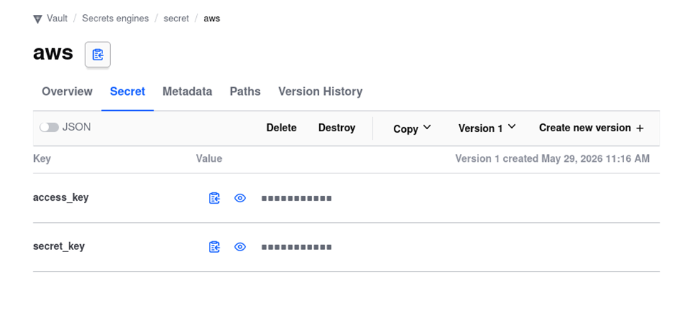

# 3-Tier AWS Cloud Architecture

**Information Technology Institute (ITI) — System Administration Track**

An end-to-end automated deployment of a highly secure, 3-tier web application on **Amazon Web Services (AWS)**. This project demonstrates production-oriented **Infrastructure as Code (IaC)** and **Configuration Management** practices using **Terraform** and **Ansible**, with a dual-secrets strategy powered by **HashiCorp Vault** and **Ansible Vault**.

---

## Table of Contents

- [Architecture Overview](#architecture-overview)
- [Live Demo & Screenshots](#live-demo--screenshots)
- [Technology Stack](#technology-stack)
- [Engineering Highlights](#engineering-highlights)
- [Project Structure](#project-structure)
- [Prerequisites](#prerequisites)
- [Deployment Guide](#deployment-guide)
- [Testing & Diagnostics](#testing--diagnostics)
- [Cleanup](#cleanup)

---

## Architecture Overview

The infrastructure is distributed across **public and private subnets** within a custom AWS VPC (`10.0.0.0/16`) to enforce network isolation and defense in depth.

```
                         Internet
                             │
                             ▼
              ┌──────────────────────────────┐
              │   Presentation Tier (Public) │
              │   Nginx — Port 80            │
              │   Static frontend + /api/*   │
              │   proxy to backend           │
              └──────────────┬───────────────┘
                             │  Private subnet traffic
                             ▼
              ┌──────────────────────────────┐
              │   Application Tier (Private) │
              │   Python Flask API — :5000   │
              │   systemd + venv             │
              └──────────────┬───────────────┘
                             │  PostgreSQL only
                             ▼
              ┌──────────────────────────────┐
              │   Data Tier (Private)        │
              │   PostgreSQL 18 — :5432      │
              │   pg_hba.conf IP restriction │
              └──────────────────────────────┘
```

| Tier | Component | Subnet | Role |
|------|-----------|--------|------|
| **1 — Presentation** | Nginx | Public (`10.0.1.0/24`) | Serves static HTML/CSS and reverse-proxies `/api/*` to the backend |
| **2 — Application** | Python Flask API | Private app (`10.0.2.0/24`) | Processes API requests and connects to PostgreSQL |
| **3 — Data** | PostgreSQL 18 | Private DB (`10.0.3.0/24`) | Relational data store with strict host-based authentication |

**Network path:** Internet Gateway for the public tier; NAT Gateway for private subnet egress. Security groups enforce a strict chain — frontend → backend → database — with no direct public access to private tiers.

---

## Live Demo & Screenshots

### Application Dashboard (End-to-End Stack Running)

The deployed frontend provides a live diagnostics panel that exercises the full request path: browser → Nginx → Flask API → PostgreSQL.



### HashiCorp Vault — AWS Credential Storage

Terraform retrieves AWS credentials from HashiCorp Vault at apply time. Secrets never live in source code or `.tfvars` files.



---

## Technology Stack

| Layer | Technology |
|-------|------------|
| **Cloud** | Amazon Web Services (AWS) — `us-east-1` |
| **Infrastructure as Code** | Terraform (modular: `network`, `security`, `compute`) |
| **Configuration Management** | Ansible (role-based playbooks) |
| **AWS Secrets** | HashiCorp Vault (KV v2) |
| **Application Secrets** | Ansible Vault (AES256-encrypted) |
| **Web Server / Reverse Proxy** | Nginx |
| **Backend API** | Python 3, Flask, Gunicorn-style via systemd |
| **Database** | PostgreSQL 18 |
| **OS** | Ubuntu 24.04 LTS |

---

## Engineering Highlights

This project goes beyond a basic deployment. It implements several patterns commonly found in production environments.

### Terraform Modules

Infrastructure is split into reusable modules under `terraform/modules/`:

| Module | Responsibility |
|--------|----------------|
| **`network`** | VPC, public/private subnets, Internet Gateway, NAT Gateway, route tables |
| **`security`** | Tier-scoped security groups with SG-to-SG ingress rules |
| **`compute`** | Three `t3.micro` EC2 instances (frontend, backend, database) |

The root `main.tf` wires modules together and uses **`templatefile`** + **`local_file`** to bridge Terraform outputs into Ansible.

### HashiCorp Vault (AWS Credentials)

Terraform authenticates to AWS using credentials stored in HashiCorp Vault — not hardcoded keys:

```hcl
ephemeral "vault_kv_secret_v2" "aws_creds" {
  mount = "secret"
  name  = "aws"
}
```

Credentials are read **ephemerally** (in-memory only) via the Vault provider at `http://127.0.0.1:8200`. Expected secret keys: `access_key`, `secret_key`.

### Ansible Vault (Database Credentials)

Database passwords are encrypted with **Ansible Vault** in `ansible/roles/database/vars/vault.yml`. The password is decrypted at playbook runtime and injected into:

- PostgreSQL user creation (database role)
- The backend systemd unit as `DB_PASS` environment variable

No plaintext credentials exist in the repository.

### Terraform-Generated Dynamic Inventory & Variables

After every `terraform apply`, four files are auto-generated with fresh private IPs:

| Generated File | Template | Purpose |
|----------------|----------|---------|
| `ansible/inventory.ini` | `inventory.tpl` | Host groups + SSH ProxyJump config |
| `ansible/roles/frontend/vars/main.yml` | `frontend_vars.tpl` | Backend IP for Nginx reverse proxy |
| `ansible/roles/backend/vars/main.yml` | `backend_vars.tpl` | Database IP for Flask connection |
| `ansible/roles/database/vars/main.yml` | `db_vars.tpl` | Backend IP for `pg_hba.conf` rule |

This eliminates manual IP tracking between IaC and configuration management.

### ProxyJump for Private Host Management

Backend and database servers live in private subnets. Ansible reaches them through the frontend bastion using **ProxyCommand** in the generated inventory:

```ini
[backend:vars]
ansible_ssh_common_args='-o ProxyCommand="ssh -W %h:%p -q ubuntu@<frontend_ip> ..."'
```

The database security group additionally allows SSH from the frontend SG to support this jump path.

### Ansible Roles

Configuration is organized into three focused roles, orchestrated by `ansible/site.yml`:

| Role | Hosts | Key Tasks |
|------|-------|-----------|
| **`frontend`** | `frontend` | Install Nginx, deploy static assets, configure reverse proxy |
| **`database`** | `database` | Install PostgreSQL 18, create user/DB, configure `pg_hba.conf`, seed data |
| **`backend`** | `backend` | Python venv, deploy Flask app, configure systemd service |

Play order: **frontend → database → backend** (database must exist before the API starts).

### Advanced Database Security (`pg_hba.conf`)

Even within the private subnet, PostgreSQL access is restricted to the **exact backend IP** (`/32` CIDR):

```
host    app_db    app_user    <backend_ip>/32    scram-sha-256
```

All other connection attempts are rejected at the database authentication layer.

### Layered Security Groups

| Security Group | Ingress |
|----------------|---------|
| Frontend | 80, 443, 22 from `0.0.0.0/0` |
| Backend | 5000, 22 from frontend SG only |
| Database | 5432, 22 from backend SG; SSH from frontend SG (ProxyJump) |

### Modern Python Environments (PEP 668)

Ubuntu 24.04's externally-managed Python environment is handled by automating a dedicated **virtual environment** (`python3 -m venv`) before installing Flask and psycopg2 dependencies.

### Self-Healing Backend (systemd)

The Flask API runs as `backend.service` with `Restart=always`, ensuring automatic startup on boot and instant recovery from crashes. Database credentials are passed via environment variables defined in the systemd unit template.

---

## Project Structure

```
3tier-project/
├── terraform/                      # Infrastructure provisioning
│   ├── main.tf                     # Module wiring + Ansible file generation
│   ├── providers.tf                # AWS + HashiCorp Vault providers
│   ├── outputs.tf                  # Public/private IP outputs
│   ├── inventory.tpl               # Ansible inventory template
│   ├── backend_vars.tpl            # Backend role vars template
│   ├── frontend_vars.tpl           # Frontend role vars template
│   ├── db_vars.tpl                 # Database role vars template
│   └── modules/
│       ├── network/                # VPC, subnets, IGW, NAT, routing
│       ├── security/               # Tier security groups
│       └── compute/                # EC2 instances
├── ansible/                        # Configuration management
│   ├── ansible.cfg
│   ├── site.yml                    # Master playbook
│   └── roles/
│       ├── frontend/               # Nginx, static assets, reverse proxy
│       ├── backend/                # Python venv, Flask, systemd
│       └── database/               # PostgreSQL, pg_hba.conf, seeding
│           └── vars/
│               ├── vault.yml       # Ansible Vault (encrypted DB password)
│               └── main.yml        # Generated by Terraform
├── app_light/                      # Application source code
│   ├── frontend/                   # HTML dashboard + diagnostics UI
│   └── backend/                    # Flask API (app.py, requirements.txt)
└── docs/
    └── images/                     # Screenshots for documentation
```

> **Note:** `ansible/inventory.ini` and `roles/*/vars/main.yml` are generated by Terraform and should not be committed manually.

---

## Prerequisites

| Requirement | Details |
|-------------|---------|
| **HashiCorp Vault** | Running locally at `http://127.0.0.1:8200` with KV secret at `secret/aws` (`access_key`, `secret_key`) |
| **Terraform** | >= 1.5.0 |
| **Ansible** | With `community.postgresql` collection installed |
| **SSH Key Pair** | `~/.ssh/3tier-key` (private) and `~/.ssh/3tier-key.pub` (used by Terraform) |
| **Ansible Vault password** | For decrypting `roles/database/vars/vault.yml` |
| **Project path** | Ansible tasks reference `~/3tier-project/` — clone or symlink accordingly |

Install the required Ansible collection:

```bash
ansible-galaxy collection install community.postgresql
```

Generate the SSH key pair:

```bash
ssh-keygen -t rsa -b 4096 -f ~/.ssh/3tier-key -N ""
```

Populate HashiCorp Vault with AWS credentials:

```bash
vault kv put secret/aws access_key="<YOUR_ACCESS_KEY>" secret_key="<YOUR_SECRET_KEY>"
```

Create or edit the Ansible Vault file (if not already configured):

```bash
ansible-vault create ansible/roles/database/vars/vault.yml
# Add: db_password: "<your-secure-password>"
```

---

## Deployment Guide

### Step 1 — Provision Infrastructure (Terraform)

```bash
cd terraform
terraform init
terraform apply
```

This creates the VPC, subnets, NAT Gateway, security groups, EC2 instances, and generates all Ansible inventory and variable files with current IP addresses.

Note the **frontend public IP** from the Terraform output:

```bash
terraform output frontend_public_ip
```

### Step 2 — Configure Servers (Ansible)

```bash
cd ../ansible
ansible-playbook -i inventory.ini site.yml --ask-vault-pass
```

You will be prompted for the Ansible Vault password to decrypt database credentials. The playbook configures all three tiers in sequence.

---

## Testing & Diagnostics

1. Open a browser and navigate to the **frontend public IP** (`http://<frontend_public_ip>`).
2. You will see the **Terraform & Ansible — AWS 3-Tier** dashboard.
3. Click **Run diagnostics**.
4. The frontend sends `GET /api/status` through Nginx.
5. Nginx reverse-proxies the request to the Flask backend in the private subnet.
6. The backend connects to PostgreSQL using Vault-injected credentials and reads from `test_table`.
7. A JSON response is displayed in the terminal panel, confirming end-to-end connectivity across all three tiers.

Expected successful response fields:

```json
{
  "tier": "Backend (Python API — Private Subnet)",
  "database_connected": true,
  "message": "..."
}
```

---

## Cleanup

To destroy all AWS resources:

```bash
cd terraform
terraform destroy
```

Ensure HashiCorp Vault and local SSH keys are managed separately — they are not removed by `terraform destroy`.

---

*Designed and engineered as a  project for the ITI System Administration Track.*
